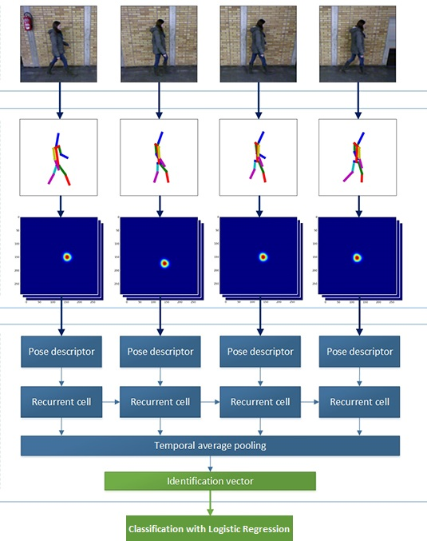
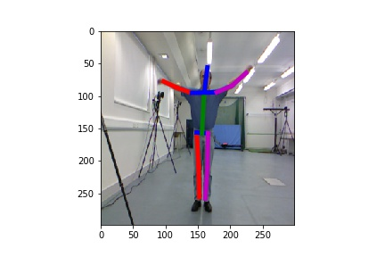
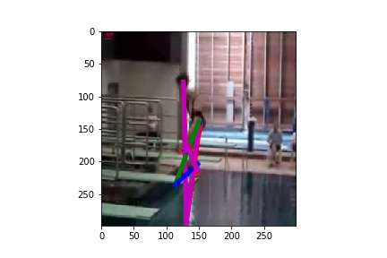
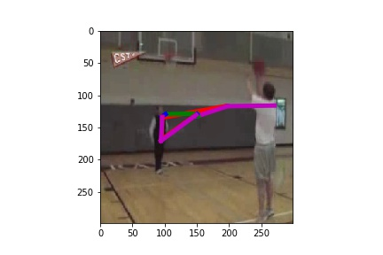

# humanpose-rnn-action-recognition
We implemented a deep neural network to predict human actions by modifying the gait recognition model by Marian Margeta (https://github.com/marian-margeta/gait-recognition). We extracted the spatial features of the human poses of each frame and extract their temporal features by running them through a Recurrent Neural Network. At last, we classify the human actions with a Logistic Regression Model using the temporal features as input.


## Datasets

1. https://www.crcv.ucf.edu/data/UCF_YouTube_Action.php

    UCF11 Dataset (or UCF Youtube Action Dataset): contains 11 action categories: basketball shooting, biking/cycling, diving, golf swinging, horse back riding, soccer juggling, swinging, tennis swinging, trampoline jumping, volleyball spiking, and walking with a dog.<br>

2. https://www.crcv.ucf.edu/data/UCF101.php

    UCF101 Dataset: "With 13320 videos from 101 action categories, UCF101 gives the largest diversity in terms of actions and with the presence of large variations in camera motion, object appearance and pose, object scale, viewpoint, cluttered background, illumination conditions, etc, it is the most challenging data set to date."<br>

3. http://dipersec.kingston.ac.uk/G3D/G3D.html

    D3G Dataset: G3D dataset contains a range of gaming actions captured with Microsoft Kinect. The Kinect enabled us to record synchronised video, depth and skeleton data. The dataset contains 10 subjects performing 20 gaming actions, from which we selected 7 categories: punch right, punch left, kick right, kick left, wave, flap arms and clap.


## Results
We were able to achieve a 94.87% accuracy on D3G dataset, 74.24% accuracy on UCF11 dataset, and 64.55% accuracy on UCF101 dataset.


## Jupyter Notebook
Go to [humanpose-rnn-action-recognition.ipynb](humanpose-rnn-action-recognition.ipynb) for our main works. 


## Basic information about architecture




## Extract features

The dummy code bellow shows how to generate the identification vector form the input data `video_frames`. For the best results, all frames should include the **whole** person visible from the **profile view**. The person should be located approximately in the center of each frame. 

```python
# Initialize computational graphs of both sub-networks
net_pose = HumanPoseIRNetwork()
net_gait = GaitNetwork(recurrent_unit = 'GRU', rnn_layers = 2)

# Load pre-trained models
net_pose.restore('path/to/pose_checkpoint.ckpt')
net_gait.restore('path/to/gait_checkpoint.ckpt')

# Create features from input frames in shape (TIME, HEIGHT, WIDTH, CHANNELS) 
spatial_features = net_pose.feed_forward_features(video_frames)

# Process spatial features and generate identification vector 
identification_vector = net_gait.feed_forward(spatial_features)
```

## Pre-trained models

### HumanPoseNN: **MPII + LSP**

**Download**: [MPII+LSP.ckpt](https://drive.google.com/file/d/1bNoZkuI0TCqf_DV613SOAng3p6Y0Si6a/view?usp=sharing)

The checkpoint `MPII+LSP.ckpt` was trained on images from [MPII](http://human-pose.mpi-inf.mpg.de) and [LSP](http://www.comp.leeds.ac.uk/mat4saj/lsp.html) database. In the graph below you can see the average distance between predicted and desired joints on a **validation set of about 6 000 images**.

### GaitNN: **H3.6m-GRU-1**

**Download**: [H3.6m-GRU-1.ckpt](models/H3.6m-GRU-1.ckpt)

The checkpoint `H3.6m-GRU-1.ckpt` was trained to identify 305 people (100 training, 150 validation, 155 testing) using 10 gait sequences for each person. These sequences catch person in three different covariate conditions: **Normal** walk, walking with **backpack** and walking with **coating shoes**. However, the people on all of these video-sequences wear the same clothing. 


The name describe used architecture (model-RNNcell-layers), so e.g. checkpoint `H3.6m-GRU-1.ckpt` should be loaded in this way:
```python
net_pose = HumanPoseIRNetwork()
net_gait = GaitNetwork(recurrent_unit = 'GRU', rnn_layers = 1)

# Load pre-trained models
net_pose.restore('models/MPII+LSP.ckpt')
net_gait.restore('models/H3.6m-GRU-1.ckpt')
```


## Data Preprocessing
```python
# process video as frames and save them as jpeg
def process_video_frames(index, root, file_path):
    video = cv2.VideoCapture(file_path)
    i = 0
    while i < MAX_NUM_FRAME_PER_VIDEO and video.isOpened():
        ret, frame = video.read()
        if ret == False:
            break
        if not os.path.exists(root + '/' + str(index)):
            os.makedirs(root + '/' + str(index))
        cv2.imwrite(root + '/' + str(index) + '/frame'+str(i)+'.jpg', frame)
        i+=1
    video.release()
    cv2.destroyAllWindows()

def process_ucf_11_dataset():
    dataset_dir = os.path.join(UCF_11_DATA_DIR, "train")
    (root, dirs, files) = next(os.walk(os.path.abspath(dataset_dir)))
    print("Processing UCF11 dataset containing", len(dirs), "classes:", dirs)
    for category in dirs:
        temp_dir = os.path.join(dataset_dir, category)
        (root, dirs, files) = next(os.walk(os.path.abspath(temp_dir)))
        print(category, "contains", len(dirs), "subfolders.")
        for sub_folder in dirs:
            sub_dir = os.path.join(temp_dir, sub_folder)               
            (root, dirs, files) = next(os.walk(os.path.abspath(sub_dir)))
            video_files = [i for i in files if i[-3:]=="mpg"]
            i = 1
            for video_file in video_files:
                video_path = os.path.join(root, video_file) 
                process_video_frames(i, root, video_path)
                i += 1
    print("Processing completed.")

# Only have to run this once
process_ucf_11_dataset()
```

## Load Dataset and Extract Features
```python
# Load dataset. This will take some time for the first loading
x, y = load_ucf_11_dataset()
```

## Load Processed Data from .csv Files
```python
# Load train and test data from saved csv
train_data = pd.read_csv('data/UCF11_train.csv')

x_train = train_data.drop(columns='label')
x_train = np.array(x_train)
y_train = train_data['label']
y_train = np.array(y_train)

test_data = pd.read_csv('data/UCF11_test.csv')

x_test = test_data.drop(columns='label')
x_test = np.array(x_test)
y_test = test_data['label']
y_test = np.array(y_test)
```

## Load from saved model
```python
# load the models from disk
logreg = joblib.load(UCF_11_LOGREG_MODEL_PATH)

# evaluate logistic regression model
y_pred_log = logreg.predict(x_test)
print("LogReg accuracy on D3G Dataset:", metrics.accuracy_score(y_test, y_pred_log))
```


## Visualisation of Pose Estimation 
```python
# sample frame from G3D dataset
visualise_pose_estimation('images/example_1.png', 'images/example_1_pose.jpg')
```
Good example:
The pose estimation performs well on G3D dataset leading to a high classification accuracy.<br>
 <br>

Bad examples:
As you can see here, the pose estimation does not work as well in UCF11 dataset. This might explain the lower accuracy achieved in the final classification.<br>
! <br>

The pose estimation performs even worser when the subject doing the action is not in the center of the frame and when there are multiple subjects in the frame.<br>
 <br>


## Prediction
```python
def predict_action(video_path, model):
    video_frames = read_video_frames(video_path)
    temporal_features = extract_features(video_frames)

    sample_features = []
    sample_features.append(temporal_features)
    sample_x =  np.array(sample_features, dtype='float32')

    # Predict
    sample_pred = model.predict(sample_x)
    # change the category here for different datasets
    print(UCF_11_CATEGORIES[sample_pred[0]]) 

sample_video_path = "samples/test_7.mp4"
predict_action(sample_video_path, logreg)
video = Video.from_file(sample_video_path)
video
```

## Discussion
Our project was a great example of Transfer Learning. The model trained previously for human gait recognition was extended here to recognize general human actions. 

One advantage of our model for human action recognition was that it extracted only the spatial and temporal information of the human pose, thus excluding the background noises. It does not work well, as we had observed, on frames where the human subject was decentralized or partially blocked or when there were multiple subjects.

To further improve the classification accuracy especially on UCF11 and UCF101 datasets, we have to standardize the video frames so that the subject performing the action is centralized and at a profile view. As we have seen from the visualization of pose estimation, some frames were wrongly estimated leading to the inaccurate results. 

For future works, the natural extension of this project would be to enable real-time action recognition on video or camera stream. We would also be exploring the possibility of combining the current popular approaches with our model through Emsemble methods to see if better results could be achieved.


## Applications
Amidst the Covid-19 situation, most people are advised to stay home.

We intend to make a webcam game based on real-time action recognition, which could encourage people to exercise at home while having fun.

The game would ask the players to do a certain sequeunce of actions and score them based on how well they did as captured on camera.  